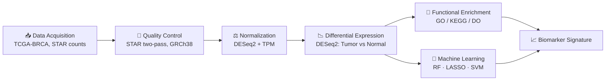

# 🧬 TCGA-BRCA RNA-seq Differential Expression and Machine Learning Analysis


```

**Ahmed Mohsin Ali¹**
¹Department of Computer Science, Jamia Millia Islamia, Jamia Nagar, New Delhi, India, 110025

*"2,384 genes whispering the same story — from raw counts to a 100%-accurate signature."*

A full transcriptomic pipeline on TCGA-BRCA: differential expression, functional enrichment, and machine learning–based biomarker discovery in breast invasive carcinoma.

---

## 📑 Table of Contents
- [Overview](#-overview)
- [The Pipeline at a Glance](#-the-pipeline-at-a-glance)
- [Dataset](#-dataset)
- [Key Results](#-key-results)
- [Repository Structure](#-repository-structure)
- [Requirements](#-requirements)
- [How to Run](#-how-to-run)
- [Citation](#-citation)
- [License](#-license)
- [Contact](#-contact)

---

## 🔬 Overview

213 breast tissue samples. 60,660 genes. One question: **what separates tumor from normal at the transcriptome level — and can a handful of genes predict it?**

This pipeline runs the full arc from raw RNA-seq counts to a validated, ML-ranked biomarker signature: quality control → normalization → differential expression → functional enrichment → classification.

> 🎯 **The headline result:** a 10-gene signature classifies tumor vs. normal with up to **100% accuracy** (LASSO) and **AUC ≈ 1.0** across all three models tested.

## 🗺️ The Pipeline at a Glance



## 🧫 Dataset

| Detail | Value |
|---|---|
| Source | TCGA-BRCA (RNA-seq, STAR counts) |
| Tumor / Normal / Total samples | 100 / 113 / 213 |
| Genes (raw) | 60,660 |
| Genes tested (post-filter) | 25,571 |

## 📊 Key Results

### By the Numbers

| 🧬 Significant DEGs | ⬆️ Upregulated | ⬇️ Downregulated | 🎯 Best Accuracy | 📐 Best AUC |
|---|---|---|---|---|
| **2,384** | **1,135** | **1,249** | **100% (LASSO)** | **≈1.0** |

### Top Enriched Pathways

Cell cycle regulation · DNA replication · PI3K–Akt signaling · p53 signaling — all hallmarks of breast tumor progression.

### Model Showdown

| Model | Accuracy | Sensitivity | Specificity | AUC |
|---|---|---|---|---|
| Random Forest | 0.9683 | 0.9394 | 1.000 | 1.000 |
| 🏆 **LASSO** | **1.0000** | **1.0000** | **1.000** | **1.000** |
| SVM | 0.9841 | 0.9697 | 1.000 | 1.000 |

### Top Biomarker Candidates

**VEGFD · MMP11 · COL10A1 · UBE2T · NEK2** — ranked by combined Random Forest importance and LASSO coefficient.

## 📁 Repository Structure

```
tcga-brca-rnaseq-degs-ml/
├── scripts/
│   └── tcga_brca_rnaseq_analysis.R
├── figures/
├── tables/
├── sessionInfo.txt
├── LICENSE
└── README.md
```

## ⚙️ Requirements

| Tool | Role |
|---|---|
| DESeq2 | Normalization & differential expression |
| clusterProfiler | GO / KEGG / Disease Ontology enrichment |
| caret, randomForest, glmnet | Machine learning (RF, LASSO) |
| pROC | ROC / AUC evaluation |
| ggplot2, pheatmap, ComplexHeatmap | Visualization |

```r
install.packages("BiocManager")
BiocManager::install(c("DESeq2","edgeR","limma","clusterProfiler","enrichplot",
                       "DOSE","org.Hs.eg.db","TCGAbiolinks","ComplexHeatmap",
                       "pathview","biomaRt"))
install.packages(c("ggplot2","pheatmap","caret","randomForest","glmnet",
                    "pROC","tidyverse"))
```

## 🚀 How to Run

```bash
git clone https://github.com/amuhsenali/tcga-brca-rnaseq-degs-ml.git
cd tcga-brca-rnaseq-degs-ml
Rscript scripts/tcga_brca_rnaseq_analysis.R
```

> 📦 Raw TCGA-BRCA data isn't redistributed here — the script pulls it directly via `TCGAbiolinks` from the [GDC Data Portal](https://portal.gdc.cancer.gov/).

## 📖 Citation

> Ali, A. M. (2026). *TCGA-BRCA RNA-seq Differential Expression and Machine Learning Analysis* [Computer software]. GitHub. https://github.com/amuhsenali/tcga-brca-rnaseq-degs-ml

## 📄 License

MIT License — see [`LICENSE`](./LICENSE).

## ✉️ Contact

**Ahmed Mohsin Ali**
